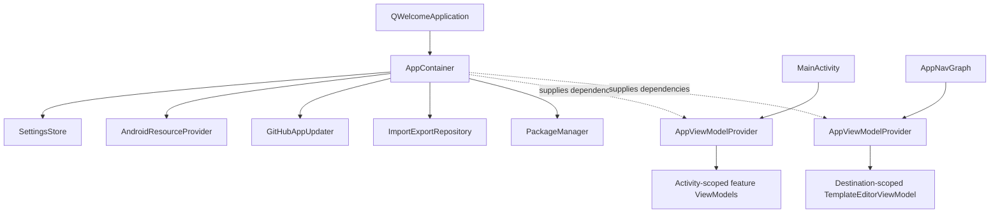
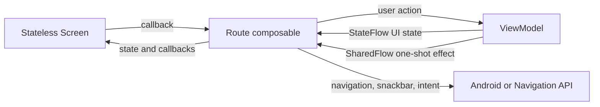

# Architecture

Q Welcome is an Android application for fiber technicians to prepare and send WiFi welcome messages. It uses Kotlin, Jetpack Compose, Material 3, Proto DataStore, and Navigation Compose. The application has two Gradle modules:

- `:app` contains Android UI, ViewModels, data access, navigation, and Android integrations.
- `:proto` owns the `UserPreferences` schema and generated Proto types.

## Dependency Lifetimes

`QWelcomeApplication` owns the process-lifetime `AppContainer`. The container holds only dependencies built with the application context, so it cannot retain an Activity.

`AppViewModelProvider` is a stateless adapter from `AppContainer` to Android's `ViewModelProvider.Factory` API. `MainActivity` creates it and uses it to create these Activity-scoped ViewModels:

- `CustomerIntakeViewModel`
- `SettingsViewModel`
- `ExportViewModel`
- `ImportViewModel`
- `TemplateListViewModel`

`AppNavGraph` creates its own factory and `TemplateEditorViewModel` at the template-editor destination. That scope gives the ViewModel the navigation back-stack entry's `SavedStateHandle`, which is required to restore the selected template or the `NEW_TEMPLATE_ID` creation sentinel.

Use `applicationContext` for process-scoped dependencies and callback work that can outlive its callback. `MainActivity` retains its Activity context for UI operations. `ShareTargetChosenReceiver` passes `context.applicationContext` to `SettingsStore` before its asynchronous work continues.

## UI, State, and Events

The application uses MVVM and explicit Route/Screen boundaries:

- Screens render plain UI state and callbacks. They do not obtain ViewModels themselves.
- Routes obtain the Activity-scoped ViewModels through `CompositionLocal`s, collect state with `collectAsStateWithLifecycle()`, and handle one-shot effects.
- `MainActivity` provides the shared feature ViewModels, `Navigator`, and `SoundPlayer` through `CompositionLocalProvider`.
- `TemplateEditorRoute` is the exception by design: the navigation graph supplies its destination-scoped ViewModel directly.
- Persistent UI state belongs in a `StateFlow`. Transient actions such as snackbars and external intents use feature-specific `SharedFlow` effects.

Navigation routes are type-safe Kotlin serialization types in `navigation/Routes.kt`. `Routes.TemplateEditor(templateId)` carries editor identity in the route, rather than storing it in the template-list state.

## Persistence and Import/Export

`SettingsStore` is the single wrapper around the `user_preferences.pb` Proto DataStore document. The schema in `proto/src/main/proto/user_preferences.proto` contains privacy settings, technician profile, user templates, active-template selection, recent share targets, and template recency data.

On first use, `PreferencesToProtoMigration` migrates the legacy preferences store into Proto DataStore. A template parsing failure aborts the migration and preserves the legacy values for manual recovery instead of silently importing partial data.

Template rules are enforced at the data boundary:

- The built-in template has the stable ID `default` and cannot be edited or deleted as a user template.
- New-template navigation uses the UI-only sentinel `__new__`.
- Required placeholders are validated before a template can become active.

`ImportExportRepository` coordinates JSON export, validation, conflict resolution, and persistence through focused services. Full-backup imports resolve template ID conflicts before calling `SettingsStore.restoreFullBackup()`, which writes selected templates, technician profile, and active-template selection in one `DataStore.updateData` transaction.

## Adding a Feature

1. Put persistence and business rules in `data/` or a focused collaborator, not in a composable.
2. Create a feature ViewModel with explicit `StateFlow` UI state and feature-specific one-shot effects where needed.
3. Add a Route composable to collect the ViewModel state and a stateless Screen composable to render it.
4. Add a serializable route in `navigation/Routes.kt` and wire it in `AppNavGraph` when the feature needs a destination.
5. Add process-scoped dependencies to `AppContainer` only when they are application-context-safe and shared. Keep `AppViewModelProvider` stateless.
6. Add or update unit tests for data and ViewModel behavior, then Compose tests for stable screen interactions.
7. Run the focused Gradle task first, then the local verification gate documented in [the roadmap](MAINTAINABILITY_SCALABILITY_ROADMAP.md).

## Useful Entry Points

- [QWelcomeApplication](../app/src/main/java/com/kingpaging/qwelcome/QWelcomeApplication.kt) initializes process-wide behavior.
- [AppContainer](../app/src/main/java/com/kingpaging/qwelcome/di/AppContainer.kt) defines process dependencies.
- [MainActivity](../app/src/main/java/com/kingpaging/qwelcome/MainActivity.kt) owns Activity-scoped ViewModels and CompositionLocals.
- [AppNavGraph](../app/src/main/java/com/kingpaging/qwelcome/navigation/AppNavGraph.kt) owns navigation and the editor destination scope.
- [SettingsStore](../app/src/main/java/com/kingpaging/qwelcome/data/SettingsStore.kt) owns persistence operations.
